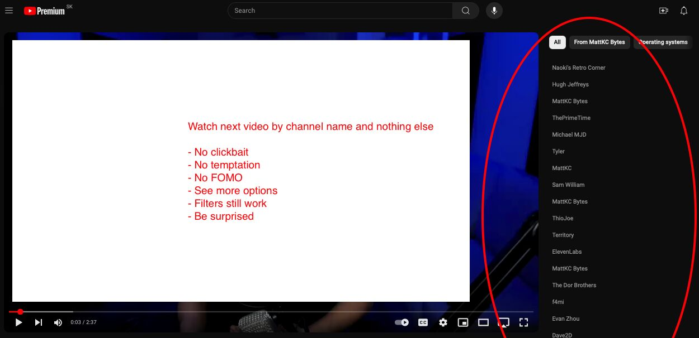

# Show Channel-Only YouTube Side Recommendations without Shorts

## Why This Exists

YouTube seems to have evolved from a community platform into an engagement-driven machine, leading to:

- Presence of clickbait [1.1] [1.2], over-optimization [2] and interest in algorithmic manipulation [3]
- Mental health implications from infinite scroll [4] (in this case also "infinite watch more")
- Reduced feeling of purpose or enjoyment on a personal level
- Creator burnout [5]

## What This Script Does

- Shows only channel names in recommendations
- Removes thumbnails, view counts, and clickbait
- Maintains core YouTube functionality
- Zero data collection, purely CSS modifications
- Works with Tampermonkey

## Benefits for the user

- Mindful viewing experience
- Reduced FOMO and anxiety
- Better content discovery
- Support for quality creators
- Time management

## Installation

1. Install Tampermonkey from official browser stores
2. Install scripts from Greasy Fork [submissions in progress] or from this GitHub repository
3. Visit YouTube and enjoy distraction-free browsing on video pages (homepage is left untouched)

Join the digital wellness movement. Share this tool if you find it helpful.

## Options for further research

[1.1] "Anyone noticed that the amount of clickbait videos drastically increased ever since dislikes were removed?", Reddit r/youtube discussion (January 2022). Available: https://www.reddit.com/r/youtube/comments/rtf8rn/anyone_noticed_that_the_amount_of_clickbait/

[1.2] "Let's Talk About YouTube Face and Clickbait", Stonemaier Games Blog Discussion (June 2023). Available: https://stonemaiergames.com/lets-talk-about-youtube-face-and-clickbait/

[2] Evidence of algorithmic optimization services:
- TubeBuddy: https://www.tubebuddy.com
- ViewStats: https://www.viewstats.com/pro-upgrade

[3] The Spiffing Brit, "YouTube Algorithm Exploitation Series" [Online video playlist]. Available: https://www.youtube.com/playlist?list=PLcXPLd_I-oBpWY299AEa5yz3y0EIQlnU3

[4] J. Smith et al., "The Loop and Reasons to Break It: Investigating Infinite Scrolling Behaviour in Social Media Applications and Reasons to Stop," Proceedings of the ACM on Human-Computer Interaction, vol. 7, no. MHCI, pp. 1-22, Sep. 2023. DOI: 10.1145/3604275. Available: https://www.researchgate.net/publication/373906218_The_Loop_and_Reasons_to_Break_It_Investigating_Infinite_Scrolling_Behaviour_in_Social_Media_Applications_and_Reasons_to_Stop

[5] Creator well-being discussion videos compilation:
Search results available:
- YouTube: https://www.youtube.com/results?search_query=(%22why+i+left+youtube%22+OR+%22philosophy+of+content+creation%22+OR+%22why+i%27m+taking+a+break%22+OR+%22creator+burnout%22+OR+%22youtube+grind+is+killing+me%22)
- Google: https://www.google.com/search?q=site:youtube.com+(%22why+i+left+youtube%22+OR+%22philosophy+of+content+creation%22+OR+%22why+i%27m+taking+a+break%22+OR+%22creator+burnout%22+OR+%22youtube+grind+is+killing+me%22)
